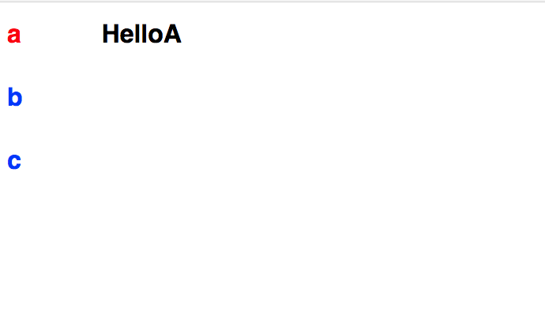

## Getting started

* Create the app
  ```
  create-react-app github
  cd github
  yarn start
  ```


* [Create a Github application](https://github.com/settings/applications/new). Make sure to set the callback URL to http://localhost:5000

* Add your `clientId` and `secretKey` to the server.js in THIS REPO.

* From this repo, start up the OAuth server.
  ```
  node server.js
  ```


## Milestone 0: Architecture diagram

We want to build a tabbed Github activity browser.


The horizontal tabs at the top are your username and the organizations you are a part of.

When you click on one of these items, we will display a vertical tab list of the repositories belonging to the user or organization.

When you click on one of the repositories, we will display the activity stream for that repository.

Here are the GitHub API calls that are relevant for our problem:
* https://developer.github.com/v3/orgs/
* https://developer.github.com/v3/repos/
* https://developer.github.com/v3/activity/events/

Draw up a rough architecture diagram (pen and paper is fine) of how you want to structure this app.

## Milestone 1: Create tabs.


We're doing something a bit different from the lecture in that we want to build both horizontal and vertical tabs and we want to nest them.

This is a library and when we build a library, we want to first start with the code that uses the library.

Start with an `App.js` that renders this:
```JSX
<TabList>
    <Tab name="a">
        <h1>HelloA</h1>
    </Tab>
    <Tab name="b">
        <h1>HelloB</h1>
    </Tab>
    <Tab name="c">
        <h1>HelloC</h1>                
    </Tab>
</TabList>
```

We want this to look like:


So let's create a `Tabs.js` that will contain both our `TabList` and `Tab` component.

For `TabList`, specify a wrapper like we did during lecture.

```JSX
const tabs = null;
const body = null;
return (
    <div className="holder">
        <div className="tabs">
        {tabs}
        </div>
        <div className="body">
        {body}
        </div>
    </div>
)
```

And let's add some styles to `App.css`

```CSS
.holder {
  display: flex;
  flex-direction: row;
}
.tabs {
  margin-left: 10px;
  display: flex;
  flex-direction: column;
}
.body {
  margin-left: 100px;  
}
```

Let's start filling in tabs.

```JSX
const tabs = React.Children.map(this.props.children, (child) => {      
return (
  <h1>{child.props.name}</h1>
);
});
```

We also want to be able to highlight a selected tab

```JSX
constructor(props) {
  super(props);
  this.state = {
      selected: 'a'
  };
}
```

```JSX
const className = (child.props.name === this.state.selected) ? "selected" : "unselected";

return (
  <h1 className={className}>{child.props.name}</h1>
);
```

```CSS
.selected {
  color: red;
}
.unselected {
  color: blue;
}
```

Let's now fill in the body

```JSX
let body;
React.Children.forEach(this.props.children, (child) => {      
  if (child.props.name === this.state.selected) {
    body = child;
  }
});
```

This should error out because it's trying to render `<Tab>` and fails to do so. We need to define our `Tab` component, which simply delegates rendering to its children.

```JSX
export class Tab extends Component {
  render () {
      return this.props.children;
  }
}
```



