## Getting started

Create the app
```
create-react-app github
cd github
yarn start
```


[Create a Github application](https://github.com/settings/applications/new). Make sure to set the callback URL to http://localhost:5000

In *THIS* repo, there is a `server.js` file that you can run. Before, we used Instagram's implicit OAuth, which can run on the client side. For GitHub's normal OAuth, we must use a service to trade the authentication code we get back on the redirect for an access token.

Add your `clientId` and `secretKey` to the `server.js` in *THIS* REPO.
```js
const clientId = {YOUR CLIENT_ID}
const secretKey = {YOUR SECRET_KEY}
```

From this repo, start up the OAuth server.
```
node server.js
```

## Milestone 0: Architecture diagram

We want to build a tabbed Github activity browser.

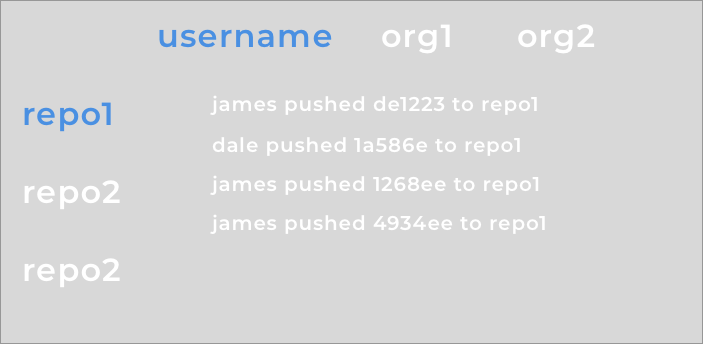

The horizontal tabs at the top are your username and the organizations you are a part of.

When you click on one of these items, we will display a vertical tab list of the repositories belonging to the user or organization.

When you click on one of the repositories, we will display the activity stream for that repository.

Here are the GitHub API calls that are relevant for our problem:
* https://developer.github.com/v3/orgs/
* https://developer.github.com/v3/repos/
* https://developer.github.com/v3/activity/events/

Draw up a rough architecture diagram (pen and paper is fine) of how you want to structure this app.

## Milestone 1: Create tabs.


We're doing something a bit different from the lecture in that we want to build both horizontal and vertical tabs and we want to nest them.

This is a library and when we build a library, we want to first start with the code that uses the library.

Start with an `App.js` that renders this:
```JSX
<TabList>
    <Tab name="a">
        <h1>HelloA</h1>
    </Tab>
    <Tab name="b">
        <h1>HelloB</h1>
    </Tab>
    <Tab name="c">
        <h1>HelloC</h1>                
    </Tab>
</TabList>
```

We want this to look like:
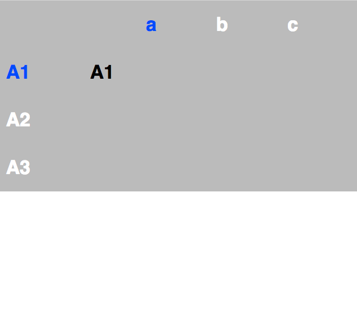

So let's create a `Tabs.js` that will contain both our `TabList` and `Tab` component.

For `TabList`, specify a wrapper like we did during lecture.

```JSX
const tabs = null;
const body = null;
return (
    <div className="holder">
        <div className="tabs">
        {tabs}
        </div>
        <div className="body">
        {body}
        </div>
    </div>
)
```

And let's add some styles to `App.css`

```CSS
.holder {
  display: flex;
  flex-direction: row;
}
.tabs {
  margin-left: 10px;
  display: flex;
  flex-direction: column;
}
.body {
  margin-left: 100px;  
}
```

Let's start filling in tabs.

```JSX
const tabs = React.Children.map(this.props.children, (child) => {      
return (
  <h1>{child.props.name}</h1>
);
});
```

We also want to be able to highlight a selected tab

```JSX
constructor(props) {
  super(props);
  this.state = {
      selected: 'a'
  };
}
```

```JSX
const className = (child.props.name === this.state.selected) ? "selected" : "unselected";

return (
  <h1 className={className}>{child.props.name}</h1>
);
```

```CSS
.selected {
  color: red;
}
.unselected {
  color: blue;
}
```

Let's now fill in the body

```JSX
let body;
React.Children.forEach(this.props.children, (child) => {      
  if (child.props.name === this.state.selected) {
    body = child;
  }
});
```

This should error out because it's trying to render `<Tab>` and fails to do so. We need to define our `Tab` component, which simply delegates rendering to its children.

```JSX
export class Tab extends Component {
  render () {
      return this.props.children;
  }
}
```

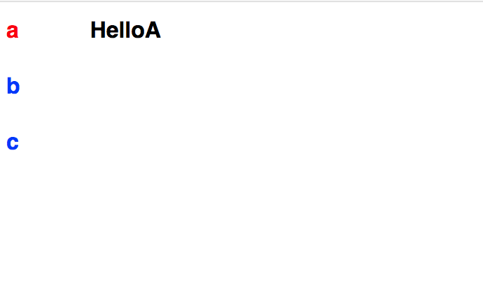

Now we can enable selection for the tabs.

```JSX
<h1
  ...
  onClick={(e) => this.select(child.props.name)}>
```

```JSX
select(item) {
  this.setState({
      selected: item
  });
}
```

We also want to add defaulting for the tabs because we can't just directly specify `this.state.selected` as we will be using `TabList` as a library.

```JSX
constructor(props) {
  super(props);
  this.state = {
    selected: null
  };
}
```

```
componentDidMount() {
  if (this.state.selected == null) {
    let defaultTab = React.Children.toArray(this.props.children).map((child) => child.props.name)[0];

    React.Children.forEach(this.props.children, (child) => {
      if (child.props.default) {
        defaultTab = child.props.name;
      }
    });

    this.setState({
      selected: defaultTab
    });
  }
}
```

Try setting Tab b to default.

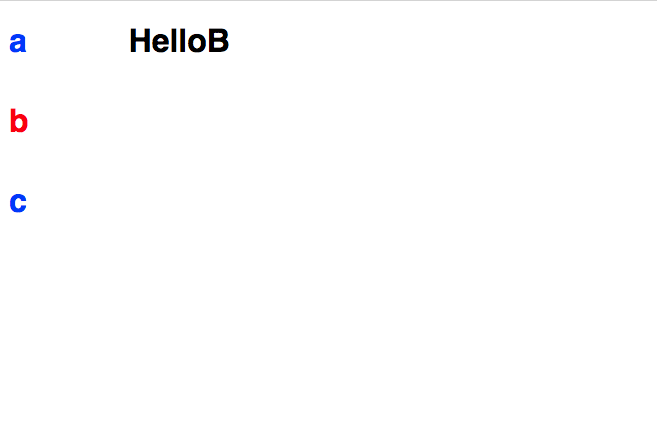

One thing we didn't discuss in lecture is what happens when the children are dynamic.

Let's modify our App.js a little. Suppose we need to load via AJAX what tabs we should show.

```JSX
class App extends Component {
  constructor(props) {
    super(props);
    this.state = {
      tabs: []
    };
  }

  componentDidMount() {
    this.setState({
      tabs: ["a", "b", "c"]
    })
  }

  render() {
    const tabs = this.state.tabs.map((t) => (
      <Tab name={t} key={t}>
        <h1>Hello{t}</h1>
      </Tab>
    ));
    return (
      <TabList>
        {tabs}
      </TabList>
    );
  }
}
```

This screws things up a bit.

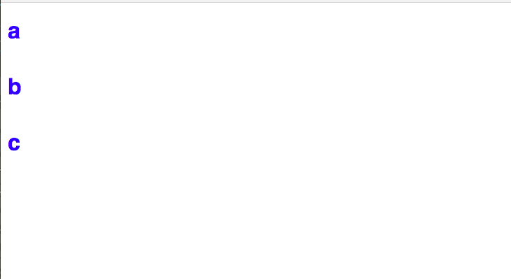

This is because if we only select the default tab at `componentDidMount`, we will have no data. Try adding a `console.log` to see this. Instead what we need to do is *ADD* `componentWillReceiveProps`. This is a function called whenever props are updated. It is not called with initial props, however.

```JSX
componentWillReceiveProps(nextProps) {
  if (this.state.selected == null) {
    let defaultTab = React.Children.toArray(nextProps.children).map((child) => child.props.name)[0];

    React.Children.forEach(nextProps.children, (child) => {
      if (child.props.default) {
        defaultTab = child.props.name;
      }
    });

    this.setState({
      selected: defaultTab
    });
  }
}
```

This function will be called twice, once with no `Tab` components and the second time with three `Tab` components.

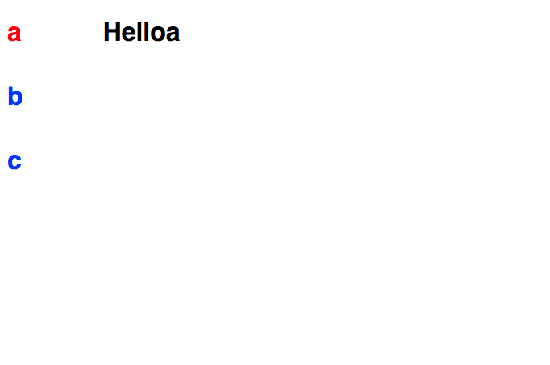

Now let's get a little wild. Let's change our App.js to render a nested list.
```JSX
componentDidMount() {
  this.setState({
    tabs: [
      ["a", ["A1", "A2", "A3"]],
      ["b", ["B1", "B2", "B3"]],
      ["c", ["C1", "C2", "c3"]]
    ]
  })
}

render() {
  const tabs = this.state.tabs.map((t) => {
    const [k, h] = t;
    const inner = h.map((k2) => {
      return (<Tab name={k2} key={k2}>
        <h1>{k2}</h1>
      </Tab>);
    });
    return (
      <Tab name={k} key={k}>
        <TabList vertical key={k}>
          {inner}
        </TabList>
      </Tab>
    );
  });

  return (
    <TabList horizontal key="root">
      {tabs}
    </TabList>
  );
}
```

These are nested TabLists and we want one to be horizontal and one to be vertical. Unfortunately, right now it looks something like this:

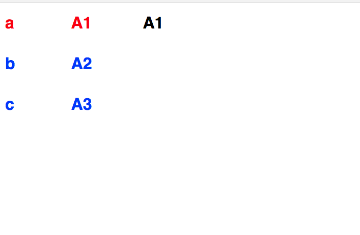

* How do we make them horizontal? Well we need to flip the flex-box direction from row to column and vice versa. Our original:


```CSS
.holder {
  display: flex;
}
.tabs {
  display: flex;  
}
```
```CSS
.holder.vertical {
  flex-direction: row;
}
.tabs.vertical {
  margin-left: 10px;
  flex-direction: column;
}
.body.vertical {
  margin-left: 100px;
}
```
```CSS
.holder.horizontal {
  flex-direction: column;
}
.tabs.horizontal {
  flex-direction: row;
}
.tabs.horizontal h1 {
  margin-right: 100px;
}
```

And then we will set the direction in `Tabs.js`;

```JSX
  const direction = this.props.horizontal ? "horizontal" : "vertical";
  return (
      <div className={`holder ${direction}`}>
          <div className={`tabs ${direction}`}>
          {tabs}
          </div>
          <div className={`body ${direction}`}>
          {body}
          </div>
      </div>
  );
```

This still looks pretty ugly and nothing like our spec so let's fix up `App.css`.

```CSS
.holder {
  display: flex;
  background: #bbb;
}
.selected {
  color: #13f;
}
.unselected {
  color: #fff;
}
.tabs-horizontal {
  flex-direction: row;
  margin-left: auto;
}
```

Ehh close enough.


## Milestone 2: Fill in the tabs with organization information

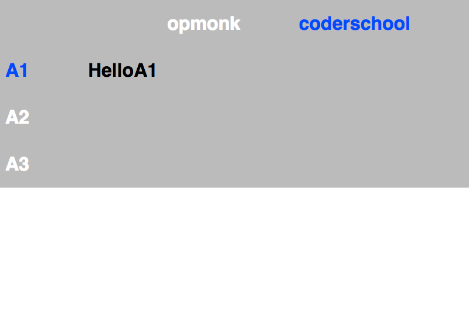

Make sure `server.js` is running. Let's alter our app so we can get an access token back from a GitHub login. This will be similar to the Instagram app we made.


```JSX
const clientId = {YOUR_CLIENT_ID}

componentWillMount() {
  const existingToken = sessionStorage.getItem('token');
  const accessToken = (window.location.search.split("=")[0] === "?access_token") ? window.location.search.split("=")[1] : null;

  if (!accessToken && !existingToken) {
    window.location.replace(`https://github.com/login/oauth/authorize?scope=user:email,repo&client_id=${clientId}`)
  }

  if (accessToken) {
    console.log(`New accessToken: ${accessToken}`);

    sessionStorage.setItem("token", accessToken);
    this.setState({
      token: accessToken
    });
  }

  if (existingToken) {
    this.setState({
      token: existingToken
    });
  }    
}
```

Let's then try to use this token to fetch data.

```JSX
componentDidMount() {
  fetch(`https://api.github.com/user/repos?access_token=${this.state.token}`)
    .then((data) => data.json())
    .then((json) => console.log(json))
}
```

If you take a look at your console you will note that this has pulled a list of your repos.

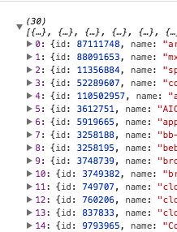

Instead of building on top of App.js, let's extract this logic into two higher level components.

Create a `GithubApi.js`.

```JSX
function withGithubLogin(WrappedComponent, clientId) {
  return class extends React.Component {
  }
}  
export function withGithub(WrappedComponent, clientId) {
  const base = class extends React.Component {
  }
  return withGithubLogin(base, clientId);
}
```

Move over `componentWillMount` into `withGithubLogin`.

```JSX
componentWillMount() {
  ...
}
render() {
  return <WrappedComponent
  token={this.state.token}
  {...this.props} />
}
```

Move over `componentDidMount` into `withGithub`.
```JSX
componentDidMount() {
  fetch(`https://api.github.com/user/orgs?access_token=${this.props.token}`)
    .then((data) => data.json())
    .then((json) => console.log(json))
}
render() {
  return <WrappedComponent      
  {...this.props} />
}
```

Move over most of `App.js` into `Homepage.js`
```JSX
export default class Homepage extends React.Component {
  constructor(props) {
    super(props);
    this.state = {
      tabs: []
    };
  }
  componentDidMount() {
    this.setState({
      tabs: [
        ["a", ["A1", "A2", "A3"]],
        ["b", ["B1", "B2", "B3"]],
        ["c", ["C1", "C2", "c3"]]
      ]
    })
  }
  render() {
    const tabs = this.state.tabs.map((t) => {
      const [k, h] = t;
      const inner = h.map((k2) => {
        return (<Tab name={k2} key={k2}>
          <h1>{k2}</h1>
        </Tab>);
      });
      return (
        <Tab name={k} key={k}>
          <TabList vertical key={k}>
            {inner}
          </TabList>
        </Tab>
      );
    });

    return (
      <TabList horizontal key="root">
        {tabs}
      </TabList>
    );
  }
}
```

Call the wrapped version of Homepage from `App.js`.
```JSX
class App extends Component {
  render() {
    const WrappedHomePage = withGithub(Homepage, clientId);
    return (
      <WrappedHomePage />
    );
  }
}
```


* Now let's abstract out fetch stuff in withGithub so that the component it wraps can access it. Make sure to delete `componentDidMount`.
```JSX
get(url) {
  return fetch(`https://api.github.com/${url}?access_token=${this.props.token}`)
    .then((data) => data.json())
}
render() {
  return <WrappedComponent      
  get={this.get.bind(this)}
  {...this.props} />
}
```

You can then modify `Homepage.js` to call this.

```JSX
componentDidMount() {
  this.props.get('user/orgs')
  .then((orgs) => console.log(orgs));
```

We're now fetching user organizations. Let's set this information into our state.

```JSX
constructor(props) {
  super(props);
  this.state = {
    orgs: []
  };
}
componentDidMount() {
  this.props.get('user/orgs')
  .then(orgs => {
      this.setState({
          orgs: orgs
      });
  });
}
```

And then use it to render our tabs

```JSX
render () {
  const tabs = this.state.orgs.map((org) => {
    return (
      <Tab name={org.login} key={org.login}>
        <TabList vertical key={org.login}>
          <Tab name="A1">
            <h1>HelloA1</h1>
          </Tab>
          <Tab name="A2">
            <h1>HelloA2</h1>
          </Tab>
          <Tab name="A3">
            <h1>HelloA3</h1>
          </Tab>
        </TabList>
      </Tab>
    );
  });
  return (
    <TabList horizontal>
      {tabs}
    </TabList>
  );
}
```


## Milestone 3: Pre-fetch repos for each organization.

Let's first think through how we want to do this. We want to go through each of our organizations and pre-fetch all repos. We also want to fetch this for our user.

The best way to do this is to use `Promise.all`, which joins together a list of promises into a promise of list. This will make more sense soon.

```bash
yarn add lodash
```

```JSX
import _ from 'lodash';
```

So let's sketch through what we want to do here. A pen and paper could be helpful for this.

We want to iterate through the orgs that we get back, creating a new promise for each (this is called forking) to request the repos for that organization. We then want to join these back together with `Promise.all` and set state appropriately.

We first want to define our empty state. We have an empty object to track orgs and an array to track our own repos.

```JSX
constructor(props) {
  super(props);
  this.state = {
    orgs: {},
    self: []
  }
}
```

In `componentDidMount`, we fetch orgs:
```JSX
this.props.get('user/orgs')
```

Then we make our requests, while keeping track of the name of the organization.
```JSX
.then(orgs => {
  const urls = orgs.map(org => [org.login, `orgs/${org.login}/repos`]);
  const fork = urls.map(obj => {
    const [name, url] = obj;
    return this.props.get(url).then(data => [name, data]);
  });
  return Promise.all(fork);
})
```

Then we zip the information back together into an object.
```JSX
.then(repos => {
  const keys = repos.map((r) => r[0]);
  const vals = repos.map((r) => r[1]);
  this.setState({
    orgs: _.zipObject(keys, vals)
  });
});
```

Concurrently, we can just grab user repos.
```JSX
this.props.get('user/repos')
.then(repos => {
  this.setState({
    self: repos
  });
});
```

We end up with a state that looks like:
```JSON
{
  orgs: {
    org1: [org1/r1],
    org2: [org2/r2, org2/r3]
  }
  self: [
    self/r4,
    self/r5
  ]
}
```

Let's figure out a good way to render this. Let's start with `self`.

```JSX
render () {
  const selfTabs = this.state.self.map((selfRepo) => {
    return (
      <Tab name={selfRepo.name} key={selfRepo.name}>
        <h1>{selfRepo.full_name}</h1>
      </Tab>
    );
  });

  return (
    <TabList horizontal>
      <Tab name="self" key="self">
        <TabList vertical key="self">
          {selfTabs}          
        </TabList>
      </Tab>
    </TabList>
  );
}
```

This should result in something like this.

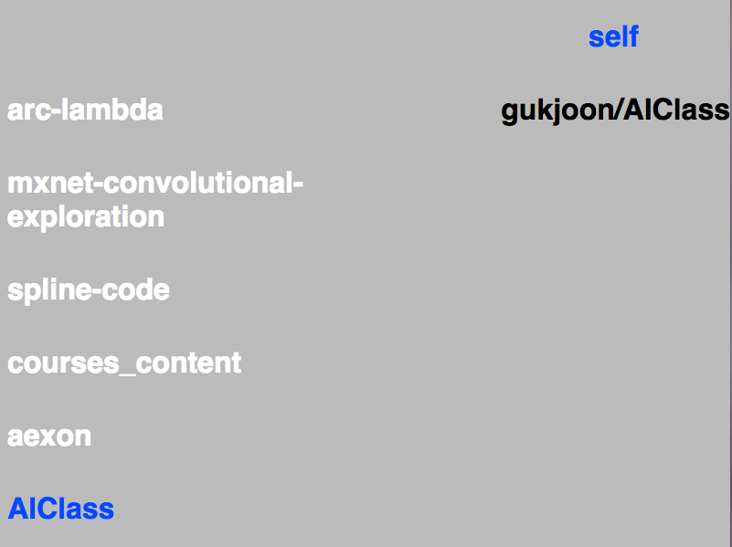

We can then construct tabs for the organization repos.

```JSX
const orgTabs = _.keys(this.state.orgs).map((org) => {
  const orgRepos = this.state.orgs[org].map((repo) => {
    return (
      <Tab name={repo.name} key={repo.name}>
        <h1>{repo.full_name}</h1>
      </Tab>
    )
  });

  return (
    <Tab name={org} key={org}>
      <TabList vertical key={org}>
        {orgRepos}
      </TabList>
    </Tab>
  );
});
```

And insert into our render.

```JSX
return (
  <TabList horizontal>
    <Tab name="self" key="self">
      <TabList vertical key="self">
        {selfTabs}          
      </TabList>
    </Tab>
    {orgTabs}
  </TabList>
);
```

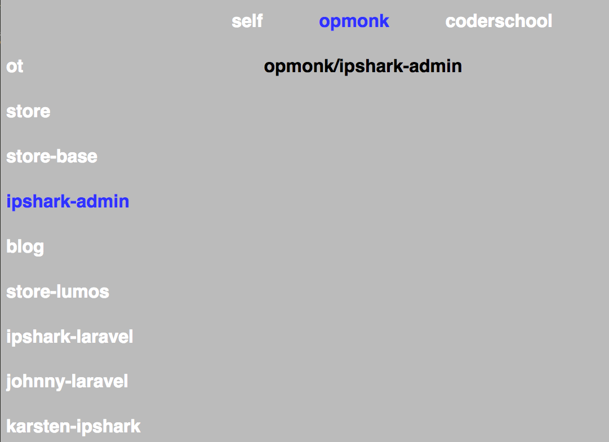